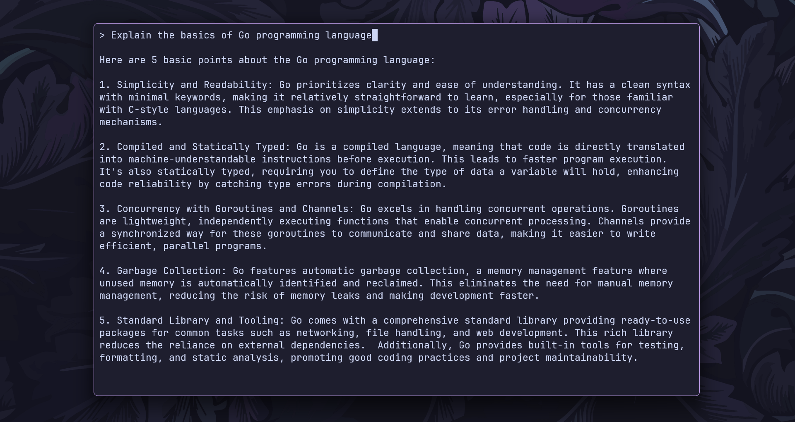

# 🧼 BubbleGem

BubbleGem is a command-line interface (CLI) for [Google Gemini](https://gemini.google.com/app), built using the [Bubble Tea framework](https://github.com/charmbracelet/bubbletea) in Go. <br>
With BubbleGem, you can ask questions and interact with the Gemini AI in your terminal environment.



## ✨ Features

- **Command-line interface**: Interact with Gemini AI from your terminal.
- **Bubble Tea framework**: Uses the Bubble Tea TUI framework for a responsive and clean user experience.
- **Loading animation**: Animated loading indicator while waiting for the AI response.

## 🛠️ Installation

### Prerequisites

- Go (version 1.18 or higher)
- Gemini AI API Key (set as an environment variable `GEMINI_API_KEY`)

### Steps

1. Clone the repository:

```bash
git clone https://github.com/ashish0kumar/BubbleGem.git
cd BubbleGem
```

2. To use `bubblegem`, you'll need an API key set in the `GEMINI_API_KEY` environment variable. If you don't already have one, create a key in [Google AI Studio](https://aistudio.google.com/app/apikey).

4. Set the `GEMINI_API_KEY` environment variable with your API key:

  - For Linux/macOS:

  ```bash
  export GEMINI_API_KEY="your-api-key-here"
  ```

  - For Windows (PowerShell):

  ```powershell
  $env:GEMINI_API_KEY="your-api-key-here"
  ```

3. Build and run the application:

```bash
go build
./bubblegem
```

### Configure Global CLI Access

To run `bubblegem` from anywhere in your terminal, follow these steps:

**For Linux/macOS:**

1. Move the binary to `/usr/local/bin`:

```bash
sudo mv bubblegem /usr/local/bin/
```

2. Ensure `/usr/local/bin` is in your `$PATH`:

Add the following line to your `~/.bashrc`, `~/.zshrc`, or appropriate shell config file if not already present:

```bash
export PATH="/usr/local/bin:$PATH"
```

3. Reload your shell configuration:

```bash
source ~/.bashrc  # or ~/.zshrc for zsh users
```

**For Windows:**

1. Move the binary to a directory included in your system's `PATH`. You can create a directory like `C:\CLI-tools` and add it to the `PATH`:

- Open **Control Panel > System and Security > System > Advanced system settings > Environment Variables**.
- Under **System variables**, find the `Path` variable, select it, and click Edit.
- Click **New**, and add the `path` where you moved the `gemgo.exe` binary (e.g., `C:\CLI-tools`).
- Click **OK** to save the changes.

2. Move the `bubblegem.exe` binary to this directory:

```powershell
move bubblegem.exe C:\CLI-tools
```
    

After this, you can access `bubblegem` globally from any terminal window.

#### Running the Application

Once globally installed, you can run `bubblegem` by typing:

```bash
bubblegem
```

## 🔧 Usage

Once you run the CLI, you can start typing questions. To submit a query, press Enter. To exit, press `Ctrl+C` or `Esc`.


## 📦 Dependencies

- [Go SDK for Google Generative AI](https://github.com/google/generative-ai-go/)
- [Charm's Bubble Tea](https://github.com/charmbracelet/bubbletea)
- [Fatih Color](https://github.com/fatih/color)

## 🤝 Contributing

Feel free to open issues and contribute to this project. All contributions are welcome!

## 📜 License

This project is licensed under the MIT License.
